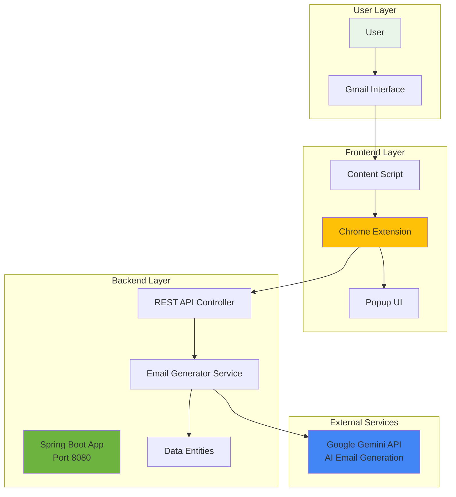
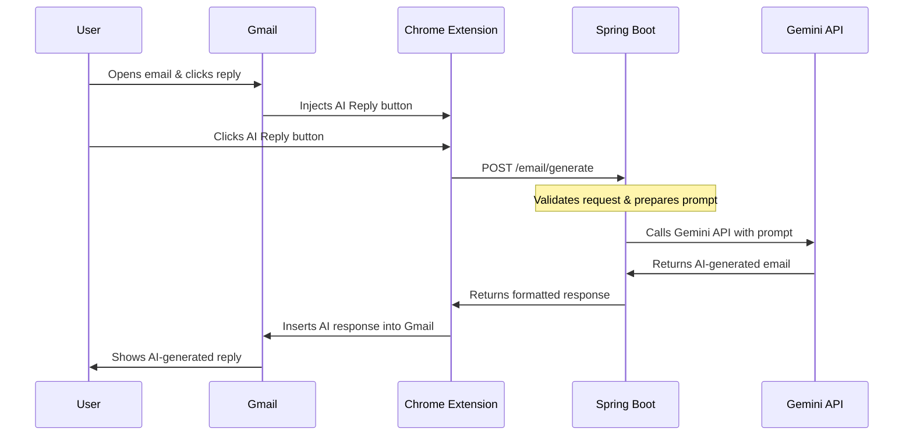
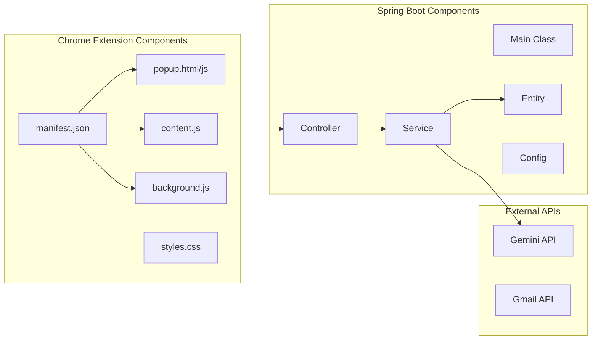
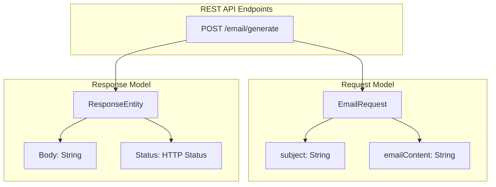
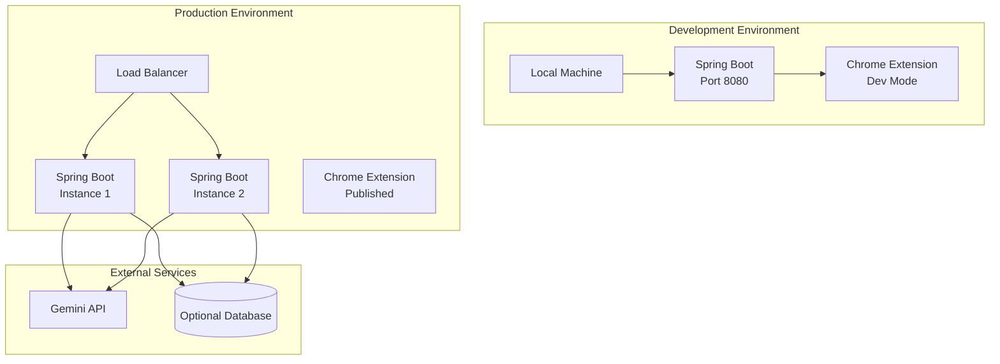
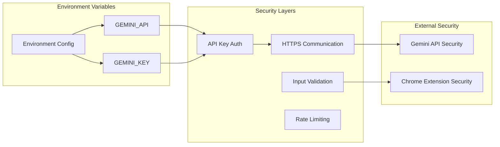
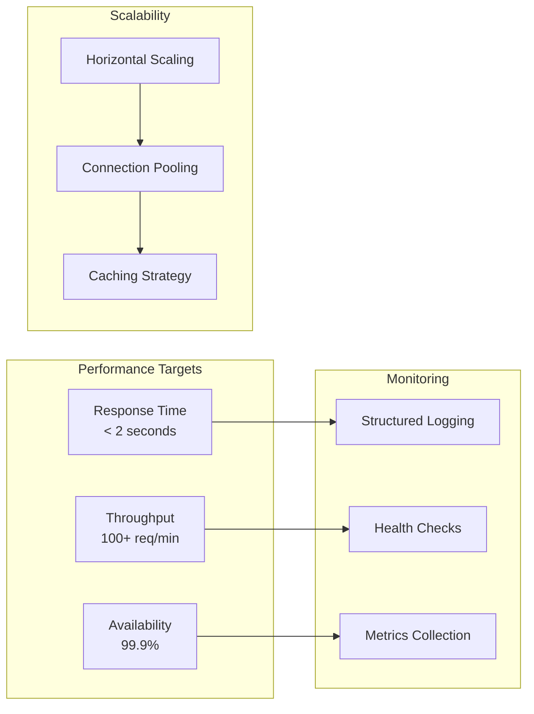
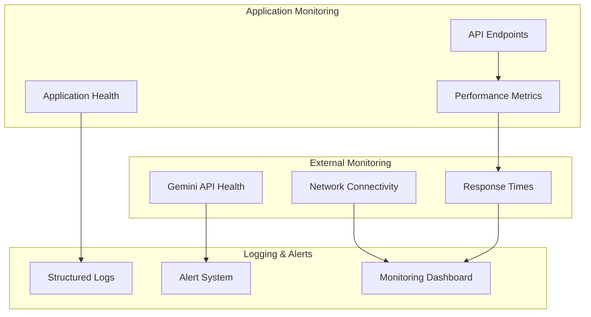

# Tanish Email Assistant - Visual System Design

## 🏗️ High-Level System Architecture

## 🔄 Data Flow Sequence

## 🏛️ Component Architecture

## 🔌 API Endpoint Design

## 🚀 Deployment Architecture

## 🔐 Security & Configuration

## 📊 Performance Metrics

## 🔄 Technology Stack

```mermaid
graph TB
    subgraph "Frontend Stack"
        CH[Chrome Extension API]
        JS[JavaScript/ES6+]
        HTML[HTML5]
        CSS[CSS3]
    end
    
    subgraph "Backend Stack"
        JAVA[Java 17]
        SB[Spring Boot 3.2.4]
        MAV[Maven 3.8.5+]
        TOM[Tomcat 10.1.19]
    end
    
    subgraph "AI & External"
        GEM[Google Gemini API]
        REST[RESTful APIs]
        JSON[JSON Data Format]
    end
    
    subgraph "DevOps & Deployment"
        DOCK[Docker]
        GIT[Git Version Control]
        ENV[Environment Config]
    end
    
    CH --> JS
    JS --> HTML
    HTML --> CSS
    JAVA --> SB
    SB --> MAV
    MAV --> TOM
    GEM --> REST
    REST --> JSON
    DOCK --> ENV
    GIT --> ENV
```

## 🔍 System Monitoring

